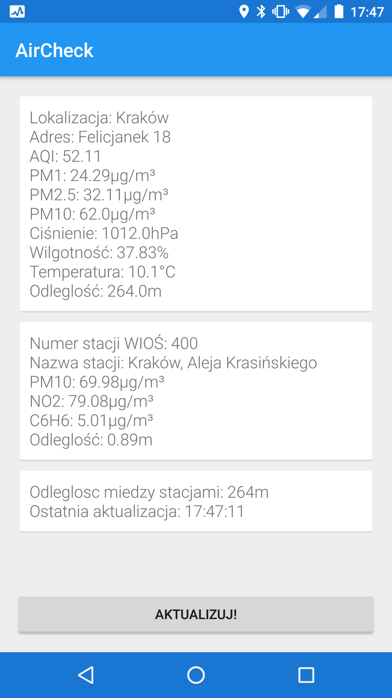
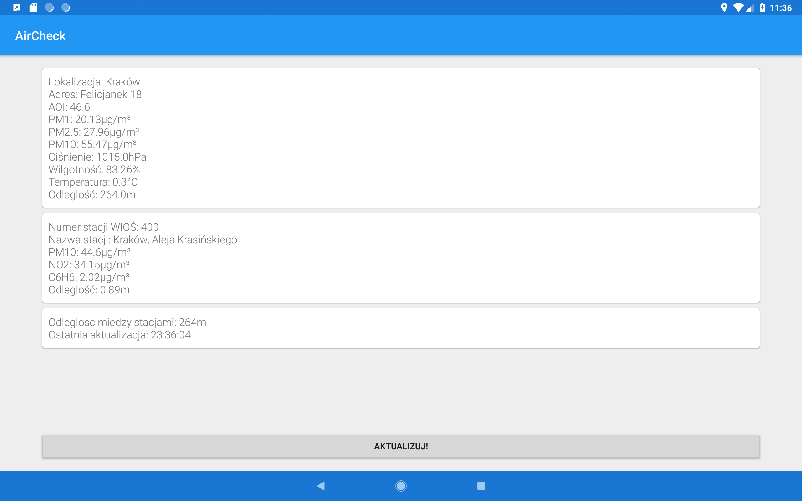

## AirCheck

AirCheck is an simple android app which combines current air pollution information from WIOŚ and Airly with very simple interface, focusing on the most important things.

## Play Store
https://play.google.com/store/apps/details?id=com.air.check

## Screenshots

## Build Requirements

* Android Studio
* Android Software Development Kit
* Java Development Kit

# Credits

*WIOŚ and Airly for API
